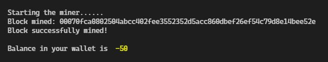
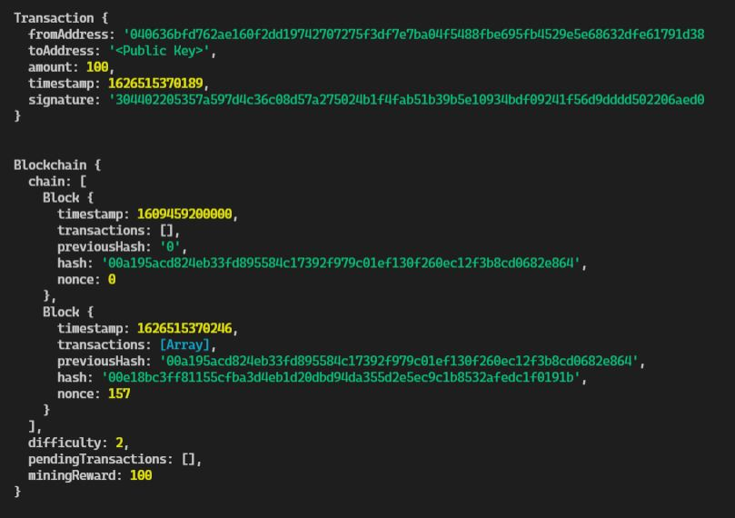

# BITScoin
A simple blockchain implemented in JavaScript.

> Not a real cryptocurrency, just a basic simulation of how they work

Blockchain technology is defined as a framework that keeps transactional records of the public referred to as **block** in several databases, which are referred to as **chain** in a network that connects through peer-to-peer nodes. The whole storage is now referred to as a digital ledger.

Every transaction stored in this ledger should be authorized by a digital signature held by the owner. This signature is required to authenticate each transaction and safeguard it from interference. When a new information block is added to it, it reduces the chances to modify the previous block, thus making each block more secure over time. This security protocol is why the information stored in a digital ledger is highly secure. The most crucial factor is that anybody can see the data, but nobody can corrupt it.

You can read more [here](https://opiria.io/what-is-blockchain-in-simple-terms/)

## Tasks 
- [x] Implement proof-of-work
- [x] Add mining rewards
- [x] Add transaction signature functionality
- [x] Build a frontend framework for the blockchain (hosted [here](thedhruvrawat.github.io/DRcoin))

## Installation

Can be used as an `npm` library by executing
```bash
$ npm install github:thedhruvrawat/BITScoin
```

Also works as a standalone application. Make sure you have `nodejs` and `npm` installed. Clone the repository in your local machine and then execute the following commands

```bash
$ cd BITScoin/src
$ node main.js
```

### Generating a key pair
In order to generate a key pair, you need to execute the following command
```bash
$ node keygen.js
```
This will generate two keys, copy and save them in some accessible location. These will be used later on to sign the transactions. Below is a sample output.
```bash
Private Key: 7528a97347706bb52c85d28f2e83aac0c67e3bb7fd5ebd0e09d720855d9f36bd
Public Key: 0456558dd8488be2b4a031c99d8c4da83f277a5312ce83d32af87fa963b784c5747df9994ceebf03ff9c89c117f1b45192c957df2a82b86adc6c60ad33ac8389c8
```

### Creating a transaction

- Step 1: Make a Blockchain instance 
```javascript
const sampleBC = new Blockchain();
```
- Step 2: Add a transaction to the blockchain 
```javascript
//Create a transaction instance
const sampleTx = new Transaction(
    <YOUR_PUBLIC_KEY>, 
    <ADDRESS_TO_SEND>,
    <AMOUNT_TO_SEND>
    )
```
```javascript
//Sign the transaction
sampleTx.sign(<YOUR_PRIVATE_KEY>);
```
```javascript
//Add transaction to blockchain
sampleBC.addTransaction(sampleTx)
```

- Step 3: Mine the transaction
```javascript
sampleBC.minePendingTransactions(<YOUR_PUBLIC_KEY>);
```

## Screenshots



Uncomment the following lines in `main.js` to see the application in action:

```javascript
console.log(tx1);
console.log(BITScoin);
```



